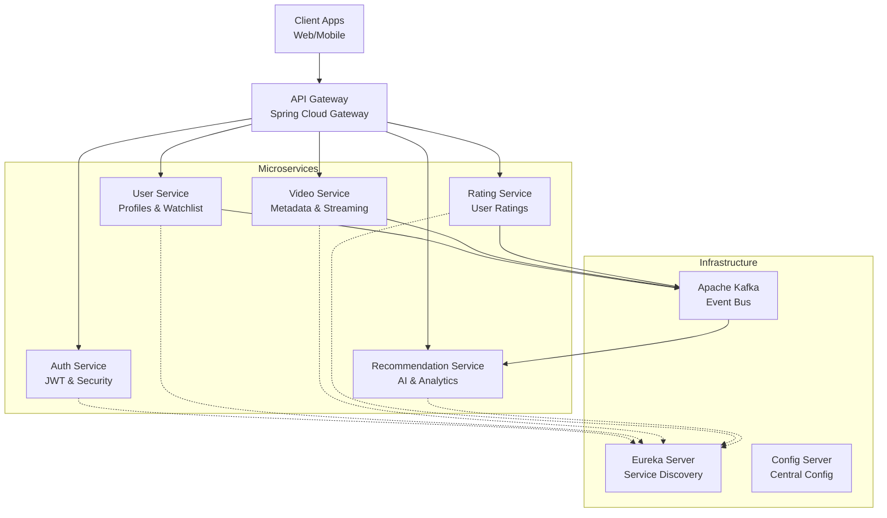

# Microservices Migration Strategy

This document outlines the architectural plan to transition the current monolithic Netflix Clone application into a scalable microservices architecture using **Spring Cloud, Eureka, and Kafka**.

## 1. Architecture Overview

## 2. Core Components

### 2.1 Service Discovery (Netflix Eureka)

- **Role**: centralized registry where all microservices register themselves.
- **Benefit**: services can find each other via logical names (e.g., `http://rating-service`) without hardcoding IPs.
- **Implementation**:
  - Create a standalone Spring Boot app with `@EnableEurekaServer`.
  - All other services add `spring-cloud-starter-netflix-eureka-client`.

### 2.2 API Gateway (Spring Cloud Gateway)

- **Role**: Single entry point for all client requests.
- **Responsibilities**:
  - Routing requests to appropriate services.
  - Authentication validation (validating JWT before passing downstream).
  - Rate limiting and Load balancing.

### 2.3 Event Bus (Apache Kafka)

- **Role**: Asynchronous communication between services. Decouples services to improve performance and scalability.
- **Use Cases**:
  - **Video Viewed Event**: When a user watches a video, `User Service` publishes an event. `Recommendation Service` listens to update user preferences.
  - **Rating Submitted Event**: `Rating Service` publishes new rating. `Video Service` listens to update average rating.
  - **New Video Uploaded**: `Video Service` publishes event. `Search Service` indexes the new content.

## 3. Proposed Microservices Decomposition

### 3.1 Auth Service

- **Responsibilities**: Login, Registration, Token Generation (JWT), Password Reset.
- **Database**: `auth_db` (Users credentials).

### 3.2 User Service

- **Responsibilities**: User profile management, Favorite categories, Watchlist management.
- **Communication**:
  - Synchronous: Calls Auth service (if needed).
  - Asynchronous (Kafka): Publishes `UserRegistered`, `WatchlistUpdated`.
- **Database**: `user_db`.

### 3.3 Video Catalog Service

- **Responsibilities**: Video metadata (title, description), Category management, Static asset links (posters).
- **Database**: `video_db`.
- **Note**: Actual video file streaming might be handled by a dedicated media server or CDN, but metadata stays here.

### 3.4 Rating & Review Service

- **Responsibilities**: Storing user ratings and reviews.
- **Communication**:
  - Listens to `VideoDeleted` events (cleanup).
  - Publishes `RatingSubmit` events for analytics.
- **Database**: `rating_db`.

### 3.5 Recommendation Service (New)

- **Responsibilities**: Generating "Recommended for You" lists.
- **Mechanism**: strictly data consumer. Listens to Kafka topics (`ViewEvents`, `RatingEvents`) to build ML models or simple heuristic suggestions.
- **Database**: `analytics_db` (NoSQL recommended, e.g., MongoDB/Cassandra).

## 4. Migration Steps

### Phase 1: Infrastructure Setup

1.  Set up **Eureka Server**.
2.  Set up **Config Server** (for externalized properties).
3.  Set up **Kafka** cluster (or single node for dev).

### Phase 2: Extraction

1.  **Extract Auth**: Move `AuthController`, `User` entity (auth parts), and JWT logic to a new project.
2.  **Extract Video**: Move `VideoController`, `Video` entity, and Categories to a new project.
3.  **Refactor Monolith**: Keep the remaining parts temporarily or turn the monolith into the "User Service" initially.

### Phase 3: Communication

1.  Implement **Feign Clients** for synchronous service-to-service calls (e.g., User Service calling Video Service to get video details for a watchlist).
2.  Implement **Kafka Producers/Consumers** for decoupled actions (e.g., Stats updates).

### Phase 4: Gateway & Completion

1.  Deploy **API Gateway**.
2.  Point Frontend to the Gateway URL.
3.  Decommission the old monolith entry points.

## 5. Technology Stack for Microservices

- **Framework**: Spring Boot 3.x / 4.x
- **Cloud**: Spring Cloud (Eureka, Config, Gateway, OpenFeign)
- **Messaging**: Spring Kafka
- **Observability**: Zipkin & Micrometer (Distributed Tracing)
- **Resiliency**: Resilience4j (Circuit Breakers)
