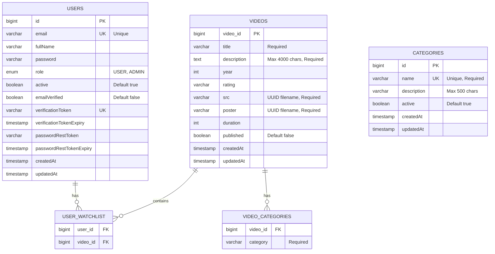

# Netflix Clone - Backend API

A full-featured Netflix clone backend application built with Spring Boot, providing authentication, user management, and video streaming capabilities.

## Project Overview

This is a RESTful API backend for a Netflix-like streaming platform. It includes user authentication with JWT, email verification, password management, and video handling features.

## Technology Stack

- Java 25
- Spring Boot 4.0.1
- Spring Security
- Spring Data JPA
- MySQL Database
- JWT (JSON Web Tokens) for authentication
- JavaMailSender for email services
- Maven for dependency management

## Features

- User Registration and Authentication
- JWT-based Authorization
- Email Verification System
- Password Reset Functionality
- User Profile Management
- Video Upload and Management
- Role-based Access Control
- CORS Configuration for Frontend Integration
- Global Exception Handling
- Auto-Seeding on Application Startup
  - Admin User Auto-Creation
  - 22 Movie Categories Auto-Creation
- Admin User Management
  - View All Users
  - View User Details
  - Suspend/Activate User Accounts
  - Delete User Accounts
  - Update User Roles
- Category Management
  - Predefined Movie/Show Categories
  - Get All Categories API
  - Category-based Video Organization

## Database Schema

The application uses the following database schema:



### Entity Relationships

- **Users to Watchlist**: One-to-Many (A user can have multiple videos in their watchlist)
- **Videos to Watchlist**: One-to-Many (A video can be in multiple users' watchlists)
- **Videos to Categories**: One-to-Many (A video can have multiple categories)
- **Categories**: Standalone table with predefined movie/show categories

### Key Constraints

- User email must be unique
- Video title, description, src (video file), and poster (image) are required
- Video categories are stored in a separate join table for flexibility
- Category names are unique and auto-seeded on application startup
- Timestamps are automatically managed by Hibernate

### Auto-Seeded Data

The application automatically seeds the following data on startup:

1. **Admin User**: Created from application.properties credentials
2. **Categories**: 22 predefined movie/show categories including:
   - Action, Adventure, Animation, Biography, Comedy, Crime
   - Documentary, Drama, Family, Fantasy, Film-Noir, History
   - Horror, Music, Musical, Mystery, Romance, Sci-Fi
   - Sport, Thriller, War, Western

## Project Structure

```
netflixclone/
│
├── src/
│   ├── main/
│   │   ├── java/com/arpon007/netflixclone/
│   │   │   ├── NetflixcloneApplication.java          # Main application entry point
│   │   │   │
│   │   │   ├── config/                               # Configuration classes
│   │   │   │   ├── CorsConfig.java                   # CORS configuration
│   │   │   │   ├── SecurityConfig.java               # Security and authentication configuration
│   │   │   │   ├── CategorySeeder.java               # Auto-seed movie categories on startup
│   │   │   │   └── AdminSeeder.java                  # Auto-seed admin user on startup
│   │   │   │
│   │   │   ├── controller/                           # REST API Controllers
│   │   │   │   ├── AuthController.java               # Authentication endpoints
│   │   │   │   ├── AdminController.java              # Admin management endpoints
│   │   │   │   ├── VideoController.java              # Video management endpoints
│   │   │   │   └── CategoryController.java           # Category endpoints
│   │   │   │
│   │   │   ├── dao/                                  # Data Access Objects (Repositories)
│   │   │   │   ├── UserRepository.java               # User database operations
│   │   │   │   ├── VideoRepository.java              # Video database operations
│   │   │   │   └── CategoryRepository.java           # Category database operations
│   │   │   │
│   │   │   ├── DTO/                                  # Data Transfer Objects
│   │   │   │   ├── request/                          # Request DTOs
│   │   │   │   │   ├── ChangePasswordRequest.java
│   │   │   │   │   ├── EmailRequest.java
│   │   │   │   │   ├── LoginRequest.java
│   │   │   │   │   ├── ResetPassword.java
│   │   │   │   │   ├── SuspendUserRequest.java
│   │   │   │   │   ├── UserRequest.java
│   │   │   │   │   └── VideoRequest.java
│   │   │   │   │
│   │   │   │   └── response/                         # Response DTOs
│   │   │   │       ├── EmailValidationResponse.java
│   │   │   │       ├── LoginResponse.java
│   │   │   │       ├── MessageResponse.java
│   │   │   │       ├── PageResponse.java
│   │   │   │       ├── UserResponse.java
│   │   │   │       ├── VideoResponse.java
│   │   │   │       ├── VideoStatsResponse.java
│   │   │   │       └── CategoryResponse.java
│   │   │   │
│   │   │   ├── entity/                               # JPA Entities
│   │   │   │   ├── User.java                         # User entity model
│   │   │   │   ├── Video.java                        # Video entity model
│   │   │   │   └── Category.java                     # Category entity model
│   │   │   │
│   │   │   ├── enums/                                # Enumeration types
│   │   │   │   └── Role.java                         # User roles enumeration
│   │   │   │
│   │   │   ├── exception/                            # Custom Exception Classes
│   │   │   │   ├── AccountDeactivatedException.java
│   │   │   │   ├── BadCredentialException.java
│   │   │   │   ├── EmailAlreadyExistsException.java
│   │   │   │   ├── EmailNotVarifiedException.java
│   │   │   │   ├── EmailSendingException.java
│   │   │   │   ├── GlobalExceptionHandeler.java      # Global exception handler
│   │   │   │   ├── InvalidCredentialsExpection.java
│   │   │   │   └── ResourceNotFoundExCeption.java
│   │   │   │
│   │   │   ├── Security/                             # Security components
│   │   │   │   ├── JwtAuthenticationFilter.java      # JWT filter for request authentication
│   │   │   │   └── JwtUtil.java                      # JWT utility methods
│   │   │   │
│   │   │   ├── Service/                              # Service Interfaces
│   │   │   │   ├── AuthService.java                  # Authentication service interface
│   │   │   │   ├── EmailService.java                 # Email service interface
│   │   │   │   ├── AdminService.java                 # Admin service interface
│   │   │   │   └── VideoService.java                 # Video service interface
│   │   │   │
│   │   │   ├── ServiceImpl/                          # Service Implementations
│   │   │   │   ├── AuthServiceImpl.java              # Authentication service implementation
│   │   │   │   ├── EmailServiceImpl.java             # Email service implementation
│   │   │   │   ├── AdminServiceImpl.java             # Admin service implementation
│   │   │   │   ├── VideoServiceImpl.java             # Video service implementation
│   │   │   │   └── FileStorageService.java           # File storage service
│   │   │   │
│   │   │   └── util/                                 # Utility classes
│   │   │       └── ServiceUtils.java                 # Common utility methods
│   │   │
│   │   └── resources/
│   │       ├── application.properties                # Application configuration
│   │       ├── static/                               # Static resources
│   │       └── templates/                            # Email templates
│   │
│   └── test/
│       └── java/com/arpon007/netflixclone/
│           └── NetflixcloneApplicationTests.java     # Application test class
│
├── target/                                           # Compiled classes and build artifacts
├── pom.xml                                           # Maven project configuration
├── mvnw                                              # Maven wrapper script (Unix)
├── mvnw.cmd                                          # Maven wrapper script (Windows)
├── Netflix_Clone_Auth_API.postman_collection.json   # Postman API collection
├── HELP.md                                           # Spring Boot help documentation
└── Readme.md                                         # Project documentation (this file)
```

## Database Configuration

The application uses MySQL as the database. Configure the following properties in `application.properties`:

```properties
spring.datasource.url=jdbc:mysql://localhost:3306/netflixdb
spring.datasource.username=your_username
spring.datasource.password=your_password
```

## Email Configuration

Email functionality requires SMTP configuration. Set up the following environment variables:

- `GMAIL_USER` - Your email address
- `GMAIL_PASS` - Your email password or app-specific password

## JWT Configuration

JWT secret key is configured in `application.properties`:

```properties
jwt.secret=your_secret_key_here
```

## File Upload Configuration

The application supports video and image uploads with configurable directories:

```properties
file.upload.video-dir=uploads/videos
file.upload.image-dir=uploads/images
spring.servlet.multipart.max-file-size=5GB
spring.servlet.multipart.max-request-size=5GB
```

## CORS Configuration

Frontend URL is configured for CORS:

```properties
app.frontend.url=http://localhost:3000
app.cors.allowed-origins=http://localhost:3000
```

## Admin Configuration

The application automatically creates an admin user on startup using credentials from application.properties:

```properties
admin.email=admin@netflixclone.com
admin.password=admin123
admin.fullname=System Administrator
```

These credentials can be changed in the `application.properties` file before running the application.

## Prerequisites

- Java Development Kit (JDK) 25 or higher
- Maven 3.6+
- MySQL 8.0+
- IDE (IntelliJ IDEA, Eclipse, or VS Code)

## Installation and Setup

1. Clone the repository
2. Configure MySQL database and create a database named `netflixdb`
3. Update `application.properties` with your database credentials
4. Set up environment variables for email configuration
5. Build the project:
   ```bash
   mvn clean install
   ```
6. Run the application:
   ```bash
   mvn spring-boot:run
   ```

The application will start on `http://localhost:8080` by default.

## API Documentation

Import the `Netflix_Clone_Auth_API.postman_collection.json` file into Postman to explore available API endpoints.

## API Endpoints Overview

### Authentication Endpoints
- User Registration
- User Login
- Email Verification
- Password Reset
- Change Password

### User Management
- Get User Profile
- Update User Profile
- Deactivate Account

### Admin Management (Admin Role Required)
- Get All Users
- Get User By ID
- Suspend User Account
- Activate User Account
- Delete User Account
- Update User Role

### Video Management
- Upload Video with Poster Image
- Add Video Description (up to 4000 characters)
- Set Video Metadata (year, rating, duration)
- Add Multiple Categories
- Set Published Status
- Get Video Details
- List Videos
- Update Video Information
- Delete Video

## Admin Features

### Auto-Seeder
The application automatically creates an admin account on first startup using credentials from `application.properties`. This ensures there is always an admin user available to manage the system.

### User Management
Administrators can perform the following operations:

1. **View All Users**: Get a complete list of all registered users with their details
2. **View User Details**: Get detailed information about a specific user by ID
3. **Suspend Users**: Deactivate user accounts with optional reason
4. **Activate Users**: Reactivate suspended user accounts
5. **Delete Users**: Permanently remove user accounts from the system
6. **Update Roles**: Change user roles between USER and ADMIN

### Security Restrictions
- Admin users cannot suspend or delete other admin accounts
- All admin endpoints require ADMIN role authentication
- JWT token with ADMIN role must be provided in the Authorization header

## Video Upload and Management

### Video Upload Features

The application supports comprehensive video upload with the following capabilities:

#### Required Fields
- **Title**: Video title (cannot be blank)
- **Description**: Full description of the video (up to 4000 characters, required)
- **Poster Image**: Thumbnail or poster image for the video (required)
- **Video File**: The actual video file to upload (required)
- **Categories**: At least one category must be selected (required)

#### Optional Fields
- **Year**: Release year of the video
- **Rating**: Content rating (e.g., PG, PG-13, R, etc.)
- **Duration**: Video duration in minutes
- **Published**: Boolean flag to publish or keep as draft (default: false)

### Upload Endpoint

**Endpoint**: `POST /api/videos/upload`

**Authentication**: Requires ADMIN role

**Content-Type**: `multipart/form-data`

**Request Parts**:

1. **data** (application/json):
```json
{
  "title": "Movie Title",
  "description": "Detailed description of the movie",
  "year": 2024,
  "rating": "PG-13",
  "duration": 120,
  "published": true,
  "categories": ["Action", "Adventure", "Sci-Fi"]
}
```

2. **video** (file): The video file (required)
3. **poster** (file): The poster/thumbnail image (required)

**Note**: All three parts (data, video, and poster) are mandatory for successful upload. The data part must include title, description, and at least one category.

### File Storage

Videos and images are stored in separate directories:

```properties
file.upload.video-dir=uploads/videos
file.upload.image-dir=uploads/images
```

Each uploaded file is renamed with a UUID to prevent conflicts:
- Format: `{UUID}_{original_filename}`
- Example: `a1b2c3d4-e5f6-7890-abcd-ef1234567890_movie.mp4`

### File Size Limits

Configured for large file uploads:

```properties
spring.servlet.multipart.max-file-size=5GB
spring.servlet.multipart.max-request-size=5GB
```

### Video Response

After successful upload, the API returns:

```json
{
  "id": 1,
  "title": "Movie Title",
  "description": "Detailed description",
  "year": 2024,
  "rating": "PG-13",
  "duration": 120,
  "src": "http://localhost:8080/api/files/video/{uuid}",
  "poster": "http://localhost:8080/api/files/image/{uuid}",
  "published": true,
  "categories": ["Action", "Adventure", "Sci-Fi"],
  "createdAt": "2024-01-16T10:30:00Z",
  "updatedAt": "2024-01-16T10:30:00Z"
}
```

### Usage Examples

#### Upload Video with All Required and Optional Fields

Using cURL:
```bash
curl -X POST http://localhost:8080/api/videos/upload \
  -H "Authorization: Bearer {admin_token}" \
  -F 'data={"title":"Sample Movie","description":"Full description of the movie with plot details and cast information","year":2024,"rating":"PG-13","duration":120,"published":true,"categories":["Action","Sci-Fi","Adventure"]};type=application/json' \
  -F 'video=@/path/to/video.mp4' \
  -F 'poster=@/path/to/poster.jpg'
```

#### Minimal Upload (Required Fields Only)

```bash
curl -X POST http://localhost:8080/api/videos/upload \
  -H "Authorization: Bearer {admin_token}" \
  -F 'data={"title":"Sample Movie","description":"This is the movie description","categories":["Drama"]};type=application/json' \
  -F 'video=@/path/to/video.mp4' \
  -F 'poster=@/path/to/poster.jpg'
```

**Important**: Title, description, at least one category, video file, and poster image are all required for successful upload.

### List All Videos

**Endpoint**: `GET /api/videos`

Returns array of all videos with their complete information including URLs to access the video and poster files.

## Exception Handling

The application implements comprehensive exception handling with custom exceptions:

- Account Deactivated Exception
- Bad Credential Exception
- Email Already Exists Exception
- Email Not Verified Exception
- Email Sending Exception
- Invalid Credentials Exception
- Resource Not Found Exception

All exceptions are handled globally by `GlobalExceptionHandeler` class.

## Security

- JWT-based authentication
- Password encryption using BCrypt
- Role-based access control
- Email verification for new accounts
- Secure password reset flow

## Development

### Running Tests

```bash
mvn test
```

### Building for Production

```bash
mvn clean package
```

The JAR file will be generated in the `target/` directory.

## License

This project is a demonstration/learning project.

## Author

MD. SHAZAN MAHMUD ARPON

## Notes

- Ensure all environment variables are properly configured before running the application
- Update JWT secret key for production deployment
- Configure proper CORS settings for production frontend URL
- Set up proper email service credentials for email functionality
